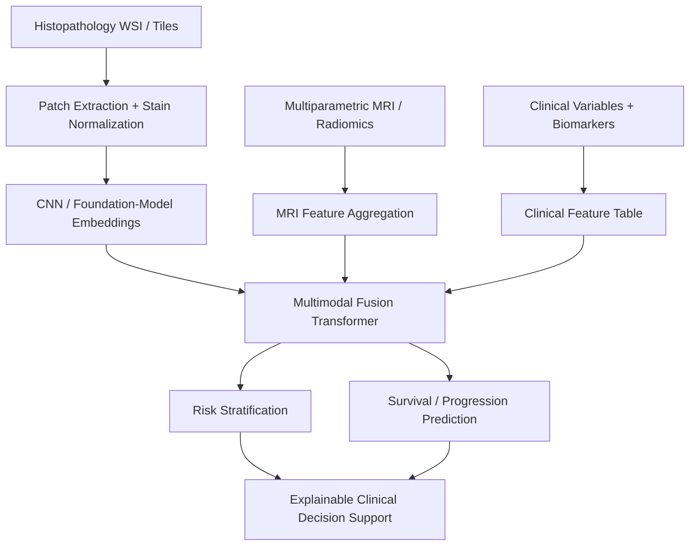
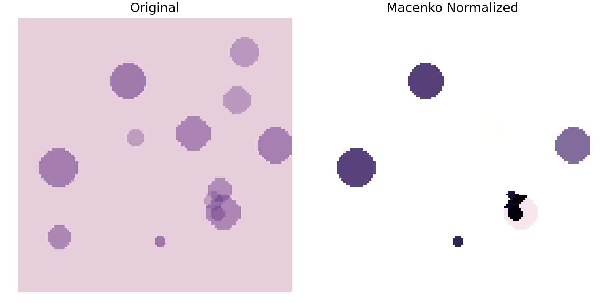
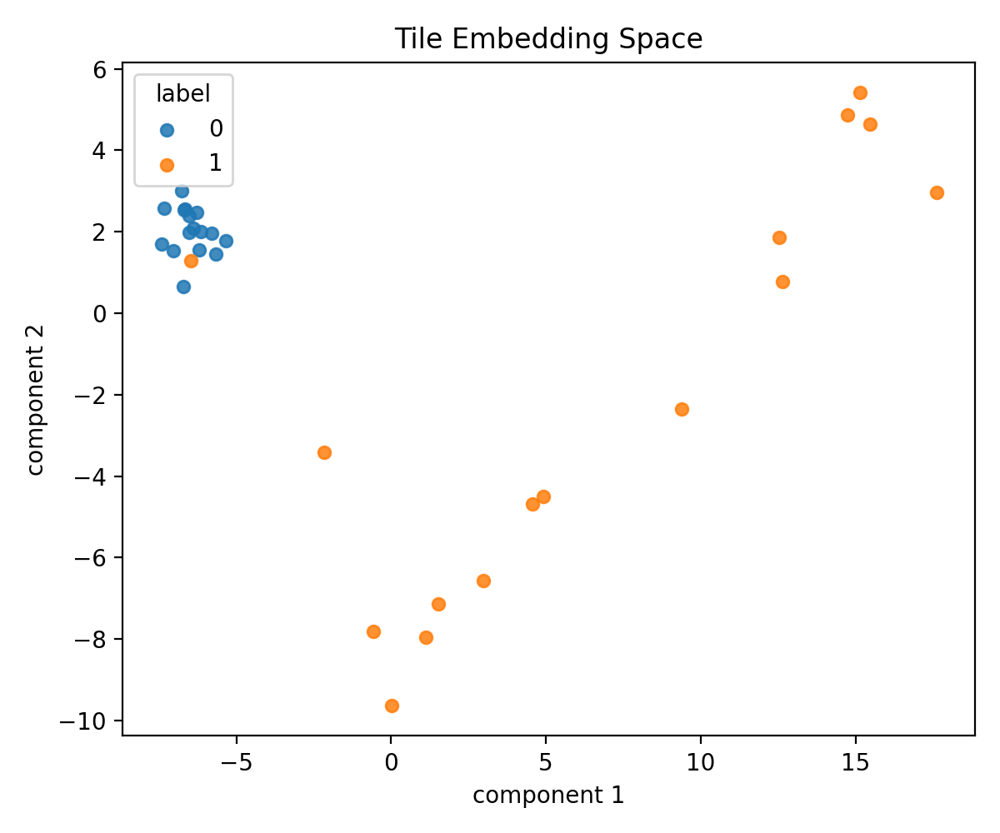
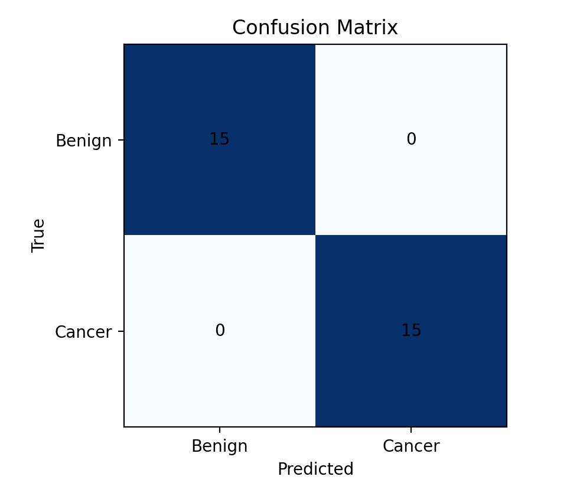
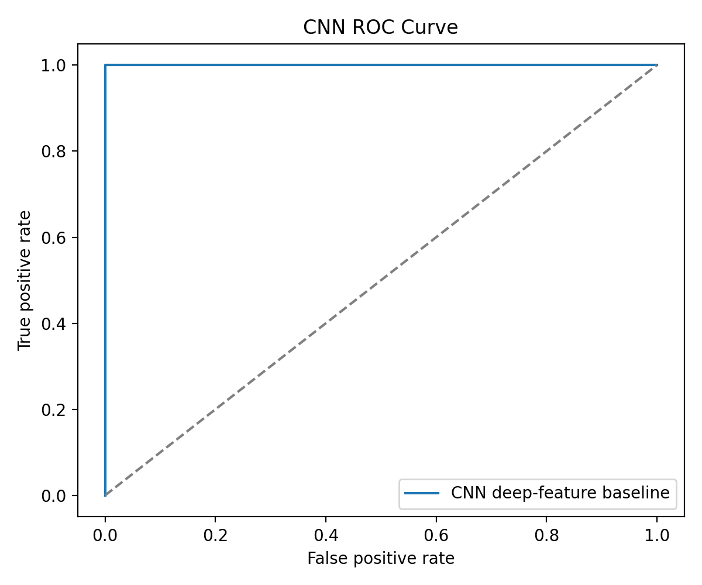
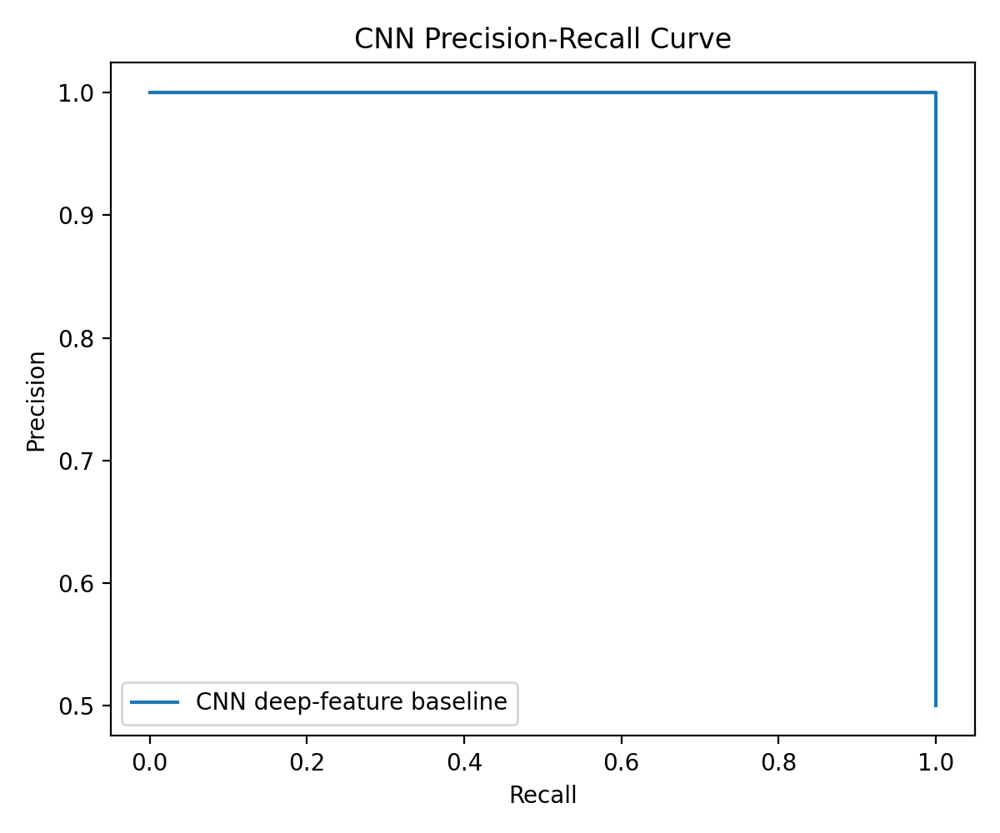
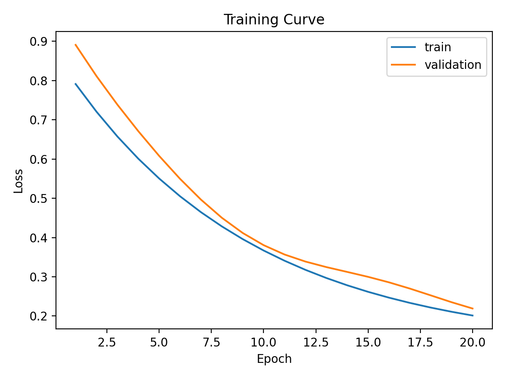
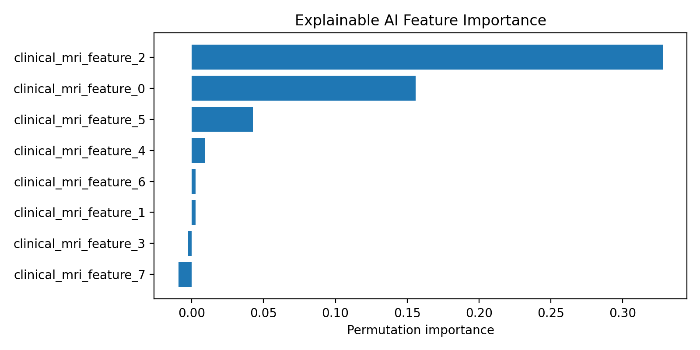
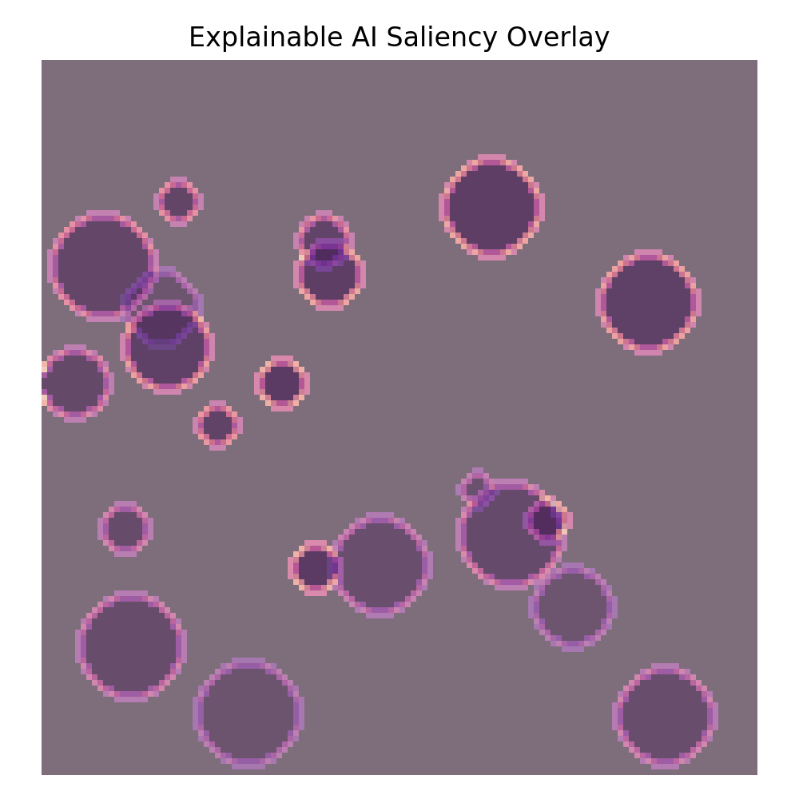

# Prostate Cancer Multimodal AI Research Pipeline


A reproducible research codebase for **prostate cancer risk stratification, multimodal fusion, explainable AI, and prognosis modeling**. The project starts from an exploratory notebook and restructures it into a GitHub-ready pipeline with modular source code, experiment scripts, generated figures, result tables, documentation, and a manuscript-style article.

> **Clinical goal:** support research toward models that can distinguish low-risk from high-risk prostate cancer, integrate MRI and pathology evidence, explain model behavior, and move beyond grade prediction toward clinically meaningful outcomes such as recurrence and progression risk.

---

## Research Question

**Can multimodal fusion of digital pathology, MRI/radiomics, biomarkers, and clinical variables improve prostate cancer risk stratification and prognosis compared with unimodal approaches, while preserving interpretability for clinical decision support?**

This repository is structured as a research scaffold for that question: it implements reproducible preprocessing, feature extraction, baseline modeling, explainability, and survival-analysis components that can later be evaluated on real patient-level cohorts.

---

## Conceptual Workflow



---

## First-Screen Summary for Supervisors

| Question | Answer |
|---|---|
| **Why this matters clinically** | Prostate cancer management depends on separating indolent disease from aggressive disease to guide biopsy, active surveillance, surgery, radiotherapy, systemic therapy, and follow-up. |
| **Modalities used** | Histopathology tiles/WSI-style workflows, MRI/radiomics features, biomarkers, clinical variables, and survival endpoints. |
| **Outcomes targeted** | Current: binary cancer/risk classification and smoke-test survival risk. Planned: recurrence risk, progression-free survival, treatment response, metastasis-free survival, and clinical report generation. |
| **Datasets supported** | Uploaded prostate notebook data, tabular clinical/MRI CSV files, synthetic smoke-test cohorts, tile image folders, and future WSI/MRI patient-level cohorts. |
| **Implemented models** | CNN-style deep-feature baseline, logistic risk model, CLAM-style attention MIL scaffold, foundation-model embedding interface, transformer fusion module, Cox-style survival model. |
| **Evaluation metrics** | ROC-AUC, PR-AUC, F1, expected calibration error, Brier score, permutation importance, saliency visualization, Kaplan-Meier curves, and concordance index. |

> **Important:** Current reported scores are smoke-test results on synthetic/demo data. They validate that the software pipeline runs end-to-end; they are **not** clinical performance claims.

---

## Implemented vs Planned

### Implemented Now

| Component | Status | Evidence in Repository |
|---|---|---|
| Histopathology preprocessing utilities | Implemented | `src/pathology/tiling.py`, `src/pathology/transforms.py` |
| Macenko stain normalization | Implemented | `src/pathology/stain_normalization.py`, `results/figures/stain_normalization_macenko.png` |
| Haralick + color features | Implemented | `src/pathology/features.py`, `results/tables/haralick_color_features.csv` |
| Deep tile embedding interface | Implemented | `src/pathology/deep_features.py`, `results/embeddings/deep_tile_embeddings.csv` |
| CNN-style result generation | Implemented smoke test | `scripts/generate_cnn_results.py`, `results/tables/cnn_metrics.csv` |
| MRI/radiomics feature table integration | Implemented smoke test | `src/pathology/mri.py`, `results/tables/mri_patient_features.csv` |
| Explainable AI utilities | Implemented smoke test | `src/pathology/explainability.py`, `results/figures/xai_feature_importance.png` |
| Survival-analysis scaffold | Implemented smoke test | `src/pathology/survival.py`, `results/figures/kaplan_meier_curve.png` |
| CLAM-style attention MIL model | Scaffold implemented | `models/clam.py`, `scripts/train_clam.py` |
| Foundation-model embedding interface | Scaffold implemented | `src/pathology/foundation_models.py` |
| Transformer multimodal fusion module | Scaffold implemented | `models/fusion_transformer.py` |
| Manuscript/reporting | Implemented | `main.tex`, `main.pdf`, `README.md` |

### Planned Future Work

| Planned Module | Goal |
|---|---|
| Full WSI attention MIL pipeline | WSI → patch extraction → tile embeddings → CLAM → slide-level prediction |
| Real foundation-model inference | Connect real Virchow, UNI, CONCH, and DINOv2-style pathology encoders |
| MRI-pathology transformer fusion | Combine MRI, pathology, biomarkers, and clinical tokens in patient-level models |
| External cohort validation | Test generalization across hospitals, scanners, staining protocols, and patient groups |
| Clinical outcome prediction | Predict recurrence, progression-free survival, treatment response, and metastasis-free survival |
| Clinical report generation | Generate interpretable patient-level summaries for research review |

---

## Validation Plan

A future real-data study should evaluate the pipeline with:

- **Internal validation:** stratified train/validation/test split and stratified k-fold cross-validation.
- **External validation:** independent cohort from a different site, scanner, or pathology laboratory.
- **Calibration analysis:** reliability curves, expected calibration error, Brier score, and calibration-in-the-large.
- **Clinical utility:** decision-curve analysis and threshold-specific sensitivity/specificity.
- **Bias and subgroup evaluation:** performance by age, PSA range, scanner/site, tumor grade, race/ethnicity where available, and treatment group.
- **Ablation studies:** pathology-only vs MRI-only vs clinical-only vs multimodal fusion.
- **Robustness checks:** stain variation, missing modalities, scanner variation, and feature perturbation.

---

## Repository Layout

```text
notebooks/              exploration and demonstrations
src/pathology/          reusable preprocessing, features, MRI, XAI, survival, metrics
models/                 CNN, risk model, CLAM, Virchow, fusion transformer definitions
scripts/                reproducible experiment entry points
results/                generated outputs: figures, tables, reports, embeddings, checkpoints
docs/                   advanced module documentation
uploads/                original uploaded notebook
main.tex                manuscript-style article
main.pdf                compiled article with results and figures
```

The workflow rule is:

```text
notebooks = exploration + demonstrations
src/      = reusable code
scripts/  = reproducible experiments
results/  = generated outputs
```

---

## Result Gallery

### Macenko Stain Normalization



**Output:** `results/figures/stain_normalization_macenko.png`

### Tile Embedding Space



**Output:** `results/figures/umap_tile_embeddings.png`  
**Note:** UMAP is used when available; otherwise the pipeline falls back to PCA.

### CNN-Style Classification Outputs

| Confusion Matrix | ROC Curve | Precision-Recall Curve |
|---|---|---|
|  |  |  |



### Explainable AI

| Feature Importance | Saliency Overlay |
|---|---|
|  |  |

### Survival Analysis


---

## Smoke-Test Results 

> These results are generated on synthetic/demo data and are included only to verify that metrics, plots, and reports are produced correctly. They should not be interpreted as biomedical or clinical performance.


### CNN Deep-Feature Baseline

| Model | ROC-AUC | PR-AUC | F1 | ECE | Brier Score |
|---|---:|---:|---:|---:|---:|
| CNN deep-feature baseline | 1.000 | 1.000 | 1.000 | 0.0017 | 0.000011 |

Source: `results/tables/cnn_metrics.csv`

### Combined Tile Pipeline

| Tiles | Handcrafted Features | Deep Features | Dimensionality Reduction |
|---:|---:|---:|---|
| 32 | 68 | 128 | PCA fallback |

Source: `results/reports/combined_pipeline_summary.csv`

### Explainable AI Top Features

| Feature | Baseline ROC-AUC | Importance |
|---|---:|---:|
| `clinical_mri_feature_2` | 0.987 | 0.328 |
| `clinical_mri_feature_0` | 0.987 | 0.156 |
| `clinical_mri_feature_5` | 0.987 | 0.043 |

Source: `results/tables/xai_permutation_importance.csv`

### Advanced Modules Summary

| Module | Output |
|---|---|
| MRI integration | 80 synthetic patients, 7 MRI feature families |
| Foundation embeddings | 16 tiles, 64-dimensional Virchow-style embeddings |
| Explainable AI | top feature: `clinical_mri_feature_2` |
| Survival analysis | 120 synthetic patients, C-index ≈ 0.621 |

Source: `results/reports/advanced_modules_report.json`

---

## Quick Start

Run all reproducible smoke workflows from the repository root.

### 1. Tile-Level Stain, Feature, and Embedding Pipeline

```bash
python scripts/run_tile_pipeline.py --synthetic --output-dir results
```

Generates:

- `results/figures/stain_normalization_macenko.png`
- `results/figures/umap_tile_embeddings.png`
- `results/tables/haralick_color_features.csv`
- `results/embeddings/deep_tile_embeddings.csv`
- `results/embeddings/tile_embedding_2d.csv`
- `results/reports/combined_pipeline_summary.csv`

### 2. CNN-Style Result Artifacts

```bash
python scripts/generate_cnn_results.py --synthetic --output-dir results
```

Generates:

- `results/checkpoints/efficientnet_best.pkl`
- `results/tables/cnn_metrics.csv`
- `results/figures/confusion_matrix.png`
- `results/figures/roc_curve.png`
- `results/figures/pr_curve.png`
- `results/figures/training_curve.png`
- `results/embeddings/cnn_deep_features.csv`
- `results/reports/cnn_results_report.json`

### 3. MRI-Informed Risk Stratification

Use a real CSV when available:

```bash
python scripts/train_risk_model.py \
  --csv Prostate_Cancer.csv \
  --target diagnosis_result \
  --positive-label M \
  --model logistic \
  --output-dir results
```

Smoke test without private data:

```bash
python scripts/train_risk_model.py --synthetic --model logistic --output-dir results
```

Reported metrics include ROC-AUC, PR-AUC, F1, expected calibration error, and Brier score.

### 4. Foundation Models, MRI, XAI, and Survival

```bash
python scripts/run_foundation_mri_xai_survival.py --output-dir results
```

Generates MRI feature tables, Virchow-style embeddings, XAI plots, Kaplan-Meier curves, and `results/reports/advanced_modules_report.json`.

### 5. Compile the Article

```bash
latexmk -pdf -interaction=nonstopmode main.tex
```

The compiled article is written to `main.pdf`.

---

## Notebook Plan

The original uploaded notebook remains at `uploads/prostate_cancer_MRI.ipynb`. The planned notebook sequence is:

1. `notebooks/01_data_exploration.ipynb`
2. `notebooks/02_wsi_visualization.ipynb`
3. `notebooks/03_mask_analysis.ipynb`
4. `notebooks/04_stain_normalization.ipynb`
5. `notebooks/05_feature_engineering.ipynb`
6. `notebooks/06_umap_analysis.ipynb`
7. `notebooks/07_tile_dataset.ipynb`
8. `notebooks/08_efficientnet_baseline.ipynb`
9. `notebooks/09_virchow_embeddings.ipynb`
10. `notebooks/10_clam_training.ipynb`

---

## Key Modules

| Module | Purpose |
|---|---|
| `src/pathology/stain_normalization.py` | Reinhard and Macenko stain normalization |
| `src/pathology/features.py` | Haralick texture and RGB histogram features |
| `src/pathology/deep_features.py` | deterministic deep tile embeddings for smoke tests |
| `src/pathology/reduction.py` | UMAP with PCA fallback |
| `src/pathology/mri.py` | MRI/radiomics feature validation and aggregation |
| `src/pathology/explainability.py` | permutation importance and saliency overlays |
| `src/pathology/survival.py` | Kaplan-Meier, Cox-style risk, C-index |
| `src/pathology/foundation_models.py` | foundation-model embedding interface |
| `models/clam.py` | attention-based multiple-instance learning |
| `models/fusion_transformer.py` | multimodal transformer fusion |

---

## Why This Repository Is Supervisor-Friendly

This repository is designed to show both implementation ability and research vision:

- **Clinical framing:** the README immediately explains why prostate cancer risk stratification matters.
- **Modern computational pathology:** the roadmap includes WSI-to-patch extraction, attention MIL, and slide-level prediction.
- **Foundation-model readiness:** the embedding interface is prepared for Virchow, UNI, CONCH, and DINOv2-style encoders.
- **Multimodal ambition:** MRI, pathology, biomarkers, and clinical variables are represented as future fusion inputs.
- **Outcome focus:** the roadmap moves toward recurrence, progression-free survival, treatment response, and survival endpoints.
- **Reproducibility:** every experiment writes figures, tables, embeddings, and reports to `results/`.
- **Communication:** the project includes `main.tex`, `main.pdf`, and an attractive README with generated figures.

---

## Clinical and Scientific Caution

This repository is a research scaffold for method development and reproducibility. It is not a medical device, diagnostic tool, or clinically validated decision-support system. Real-world use would require institutional review, data governance, independent validation, calibration checks, bias analysis, and prospective clinical evaluation.
